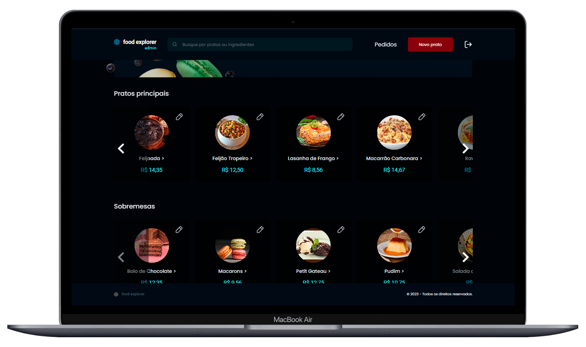
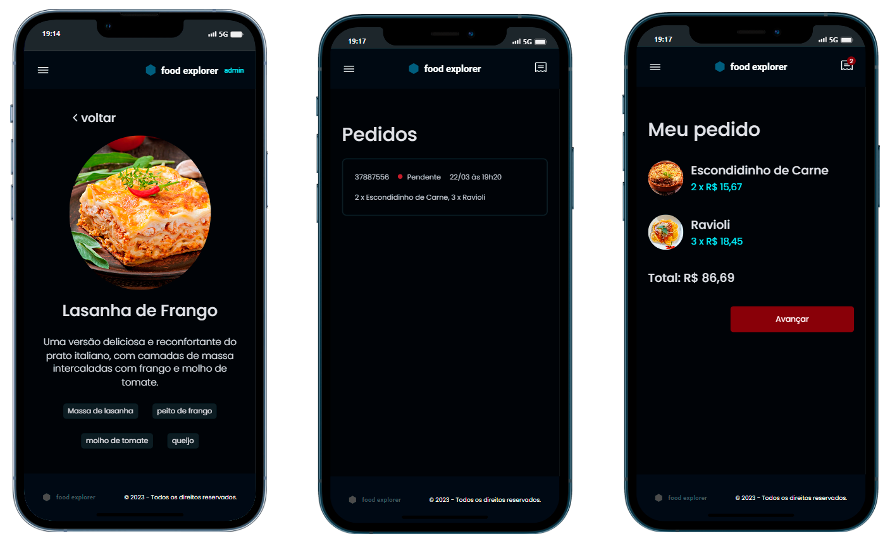
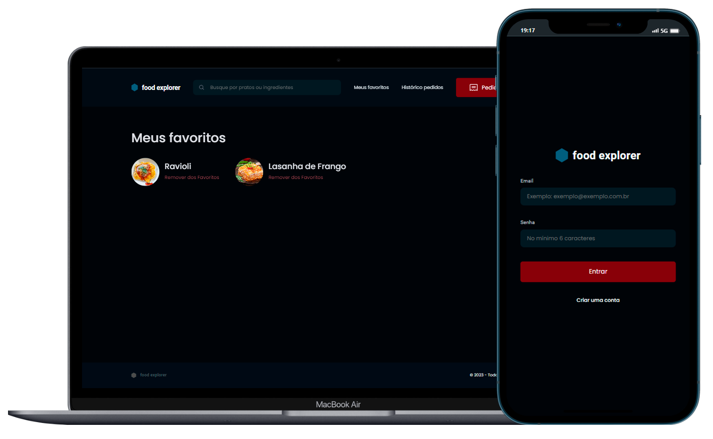

# Food Explorer

## 📷 Galeria | Gallery





[Português](#sobre-o-projeto) | [english](#about-the-project)

## Sobre o projeto

Este projeto foi desenvolvido para a conclusão da formação explorer da escola de programação [Rocketseat](https://www.rocketseat.com.br/), o desafio consiste em criar um `cardápio online` para um restaurante. Este repositório contem os códigos do front-end da aplicação, que irá consumir a [API](https://github.com/fabricioliquesley/foodExplorer-back-end) que também foi desenvolvida para a conclusão da formação.

[Ver projeto finalizado](https://food3explorer.netlify.app/)

## 🛠 Tecnologias usadas


## 📋 Como usar

### 1 - Iniciando um repositório git

```
git init
```

### 2 - Clone o repositório

```
git clone https://github.com/fabricioliquesley/foodExplorer-front-end.git
```

### 3 - Instalando as dependências

```
npm install
```

### 4 - Executando o projeto

```
npm run dev
```

## About the project

This project was developed to complete the explorer training course at the [Rocketseat](https://www.rocketseat.com.br/) programming school. The challenge consists of creating an online menu for a restaurant. This repository contains the application's front-end code, which will consume the [API](https://github.com/fabricioliquesley/foodExplorer-back-end) also developed to complete the course.

[See finished project](https://food3explorer.netlify.app/)

## 🛠 Technologies used


## 📋 How to use

### 1 - Starting a git repository

```
git init
```

### 2 - Clone the repository

```
git clone https://github.com/fabricioliquesley/foodExplorer-front-end.git
```

### 3 - Installing the dependencies

```
npm install
```

### 4 - Running the project

```
npm run dev
```